# VISION - Architecture Document

## System Architecture Diagram (Mermaid)

```mermaid
graph TB
    subgraph "Data Sources Layer"
        OANDA[OANDA API<br/>Forex Real-time]
        BINANCE[Binance WebSocket<br/>Crypto Real-time]
        CME[CME/Gold APIs<br/>Futures Data]
        AV[Alpha Vantage<br/>Historical Data]
        CFTC[CFTC/COT Reports<br/>Weekly Institutional]
        SEC[SEC EDGAR<br/>13F Filings]
        ONCHAIN[Glassnode/Etherscan<br/>On-chain Analytics]
        BOOKMAP[Order Book Feeds<br/>Level 2 Data]
    end

    subgraph "Ingestion Layer"
        WS_MANAGER[WebSocket Manager<br/>Real-time Streams]
        REST_FETCHER[REST Fetcher<br/>Polling / Scheduled]
        CELERY[Celery Workers<br/>Async Tasks]
        RMQ[RabbitMQ<br/>Message Broker]
    end

    subgraph "Data Layer"
        PG[(PostgreSQL<br/>Trades, History,<br/>COT, Indicators)]
        REDIS[(Redis<br/>Cache, Pub/Sub,<br/>Real-time State)]
        TS[(TimescaleDB ext.<br/>Time-series OHLCV)]
    end

    subgraph "Core Engine"
        INDICATOR[Indicator Engine<br/>OBV, A/D, ATR, RSI<br/>TA-Lib + Custom]
        VOLUME[Volume Analyzer<br/>Spike Detection<br/>Accumulation/Distribution]
        SD_ZONES[Supply/Demand<br/>Zone Detector<br/>Multi-timeframe]
        PATTERN[Pattern Detector<br/>Cup&Handle, Breakouts<br/>ML-assisted]
        COT_PARSER[COT/13F Parser<br/>Position Changes<br/>Net Long/Short]
        ONCHAIN_ANALYZER[On-chain Analyzer<br/>Whale Tracking<br/>Large Transfers]
        ORDERBOOK[Order Book Analyzer<br/>Walls, Spoofing<br/>Absorption]
        REL_STRENGTH[Relative Strength<br/>vs DXY, BTC Dom,<br/>Real Rates]
    end

    subgraph "ML Pipeline"
        FEATURE_ENG[Feature Engineering<br/>Divergences, Ratios]
        MODEL[Prediction Model<br/>Reversal Probability<br/>scikit-learn/TF]
        BACKTEST[Backtesting Engine<br/>Historical Validation]
    end

    subgraph "Alert System"
        ALERT_ENGINE[Alert Engine<br/>Threshold Monitoring]
        EMAIL_SMS[Email/SMS<br/>Twilio Integration]
        PUSH[Push Notifications<br/>WebSocket Events]
    end

    subgraph "API Layer"
        FASTAPI[FastAPI Server<br/>REST + WebSocket]
        AUTH[Auth Service<br/>JWT/OAuth2]
        RATE_LIMIT[Rate Limiter<br/>Redis-based]
    end

    subgraph "Frontend"
        NEXT[Next.js App<br/>SSR + SPA]
        CHARTS[TradingView/Plotly<br/>Interactive Charts]
        DASHBOARD[Dashboard<br/>Multi-asset Monitor]
        RISK_CALC[Risk Calculator<br/>Position Sizing]
        JOURNAL[Trade Journal<br/>Post-mortem Analysis]
    end

    subgraph "External Integration"
        MT5[MetaTrader 5<br/>Forex Bots]
        CCXT_BOT[CCXT Bots<br/>Crypto Trading]
        WEBHOOK[Webhooks<br/>Custom Integrations]
    end

    subgraph "Infrastructure"
        DOCKER[Docker Compose<br/>Containerization]
        NGINX[Nginx<br/>Reverse Proxy]
        PROM[Prometheus<br/>Metrics]
        GRAFANA[Grafana<br/>Monitoring]
    end

    %% Data flow
    OANDA --> WS_MANAGER
    BINANCE --> WS_MANAGER
    CME --> REST_FETCHER
    AV --> REST_FETCHER
    BOOKMAP --> WS_MANAGER
    CFTC --> CELERY
    SEC --> CELERY
    ONCHAIN --> CELERY

    CELERY --> RMQ
    RMQ --> CELERY

    WS_MANAGER --> REDIS
    REST_FETCHER --> PG
    CELERY --> PG

    REDIS --> INDICATOR
    PG --> INDICATOR
    TS --> INDICATOR

    INDICATOR --> VOLUME
    INDICATOR --> SD_ZONES
    INDICATOR --> PATTERN
    INDICATOR --> REL_STRENGTH
    COT_PARSER --> PG
    ONCHAIN_ANALYZER --> PG
    ORDERBOOK --> REDIS

    VOLUME --> ALERT_ENGINE
    SD_ZONES --> ALERT_ENGINE
    PATTERN --> ALERT_ENGINE
    COT_PARSER --> ALERT_ENGINE
    ONCHAIN_ANALYZER --> ALERT_ENGINE

    INDICATOR --> FEATURE_ENG
    FEATURE_ENG --> MODEL
    MODEL --> BACKTEST

    ALERT_ENGINE --> EMAIL_SMS
    ALERT_ENGINE --> PUSH

    FASTAPI --> AUTH
    FASTAPI --> RATE_LIMIT
    FASTAPI --> INDICATOR
    FASTAPI --> MODEL
    FASTAPI --> ALERT_ENGINE

    NEXT --> FASTAPI
    CHARTS --> FASTAPI
    DASHBOARD --> NEXT
    RISK_CALC --> NEXT
    JOURNAL --> NEXT

    FASTAPI --> MT5
    FASTAPI --> CCXT_BOT
    FASTAPI --> WEBHOOK

    DOCKER --> NGINX
    PROM --> GRAFANA
```



## Component Details

### 1. Data Sources Layer
Each data source has a dedicated adapter implementing a common interface:

```
┌─────────────────────────────────────────────────────┐
│                 DataSourceAdapter (ABC)              │
├─────────────────────────────────────────────────────┤
│ + connect()                                         │
│ + disconnect()                                      │
│ + fetch_ohlcv(symbol, timeframe, limit) -> DataFrame│
│ + stream_prices(symbol, callback)                   │
│ + fetch_orderbook(symbol, depth) -> OrderBook       │
│ + get_supported_symbols() -> List[str]              │
│ + get_market_type() -> MarketType                   │
├─────────────────────────────────────────────────────┤
│ Implementations:                                    │
│  - OandaAdapter (forex)                             │
│  - BinanceAdapter (crypto)                          │
│  - AlphaVantageAdapter (multi-asset historical)     │
│  - CMEAdapter (gold futures)                        │
│  - CCXTAdapter (unified exchange access)            │
└─────────────────────────────────────────────────────┘
```

### 2. Core Engine - Indicator Pipeline

```
Raw OHLCV Data
    │
    ├──► Volume Analyzer
    │       ├── Spike Detection (>2-3x avg 20 periods)
    │       ├── Accumulation vs Distribution classification
    │       └── Tick volume normalization (forex)
    │
    ├──► OBV / A/D Calculator
    │       ├── Running calculation per timeframe
    │       └── Divergence detector (price vs indicator)
    │
    ├──► Supply/Demand Zone Detector
    │       ├── Historical zone identification
    │       ├── Multi-timeframe confluence (H4, D1, W1)
    │       └── Volatility-adjusted width
    │
    ├──► Pattern Detector (ML-assisted)
    │       ├── Cup & Handle, Tight Ranges
    │       ├── Breakout with volume confirmation
    │       └── Trained CNN/LSTM for recognition
    │
    ├──► Relative Strength Calculator
    │       ├── Forex vs DXY
    │       ├── Gold vs Real Rates (TIPS yield)
    │       └── Crypto vs BTC Dominance
    │
    └──► Order Book Analyzer
            ├── Liquidity wall detection
            ├── Spoofing pattern detection
            └── Order absorption tracking
```

### 3. Database Schema (High-level)

```
┌──────────────┐   ┌──────────────┐   ┌──────────────────┐
│   assets     │   │  ohlcv_data  │   │   indicators     │
├──────────────┤   ├──────────────┤   ├──────────────────┤
│ id           │   │ id           │   │ id               │
│ symbol       │──►│ asset_id     │   │ asset_id         │
│ market_type  │   │ timeframe    │   │ timeframe        │
│ exchange     │   │ timestamp    │   │ timestamp        │
│ is_active    │   │ open/high/   │   │ indicator_type   │
│ config_json  │   │ low/close    │   │ value            │
└──────────────┘   │ volume       │   │ metadata_json    │
                   └──────────────┘   └──────────────────┘

┌──────────────────┐   ┌──────────────────┐   ┌─────────────────┐
│  cot_reports     │   │  alerts          │   │  trades_journal │
├──────────────────┤   ├──────────────────┤   ├─────────────────┤
│ id               │   │ id               │   │ id              │
│ asset_id         │   │ user_id          │   │ user_id         │
│ report_date      │   │ asset_id         │   │ asset_id        │
│ commercial_long  │   │ alert_type       │   │ entry_price     │
│ commercial_short │   │ condition_json   │   │ exit_price      │
│ noncomm_long     │   │ is_triggered     │   │ position_size   │
│ noncomm_short    │   │ channel          │   │ pnl             │
│ net_positions    │   │ last_triggered   │   │ notes           │
└──────────────────┘   └──────────────────┘   └─────────────────┘

┌──────────────────┐   ┌──────────────────┐
│  users           │   │  onchain_events  │
├──────────────────┤   ├──────────────────┤
│ id               │   │ id               │
│ email            │   │ asset_id         │
│ password_hash    │   │ event_type       │
│ role             │   │ address_from     │
│ preferences_json │   │ address_to       │
│ api_keys_enc     │   │ amount           │
└──────────────────┘   │ timestamp        │
                       └──────────────────┘
```

### 4. Real-time Data Flow

```
Exchange WebSocket ──► WS Manager ──► Redis Pub/Sub ──► FastAPI WebSocket ──► Browser
                            │
                            ▼
                     Indicator Engine (calculates on each tick/candle)
                            │
                            ▼
                     Alert Engine (checks thresholds)
                            │
                            ├──► Push to browser via WS
                            ├──► Email/SMS via Twilio
                            └──► Webhook to external bots
```

### 5. ML Pipeline Architecture

```
Historical Data (per asset/timeframe)
    │
    ▼
Feature Engineering
    ├── OBV divergence score
    ├── A/D divergence score
    ├── Volume spike magnitude
    ├── Supply/demand zone proximity
    ├── COT net position change rate
    ├── Relative strength vs benchmark
    ├── Order book imbalance ratio
    └── On-chain whale activity score
    │
    ▼
Model Training (scikit-learn / TensorFlow)
    ├── Random Forest (baseline)
    ├── Gradient Boosting (XGBoost)
    └── LSTM (sequential patterns)
    │
    ▼
Prediction: Reversal probability (0-1) + direction + confidence
    │
    ▼
Backtesting Engine
    ├── Walk-forward validation
    ├── Sharpe ratio, max drawdown
    └── Per-market performance metrics
```
